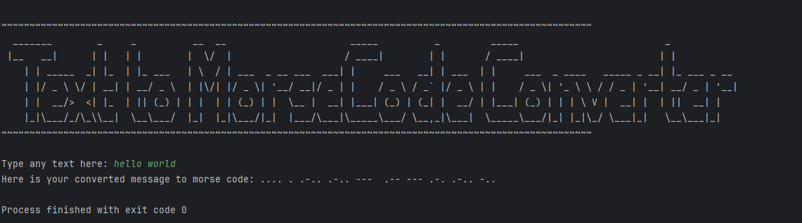

# Text to Morse Converter

Python script to convert text to morse code

  

Morse code is a method used in telecommunication to encode text characters as standardized sequences of two different signal durations, called dots and dashes, or dits and dahs. Morse code is named after Samuel Morse, one of the early developers of the system adopted for electrical telegraphy.

## Module used

morse_converter.py: The module contains a dictionary with key-value pairs, which map characters to their corresponding Morse code representations. 
This dictionary serves as a reference for the conversion process. Additionally, the module includes a function that converts a given string of text into Morse code.

## Data structures
- Dictionary and Strings

## Usage
Run "python ./morse_converter.py". This will prompt you to type any text that you wish to convert.

## Author
👩‍💻 Mutshinya Virginia Mudau

- GitHub: <a href='https://github.com/virgym' target='_blank'>@virgym</a>
- LinkedIn: <a href='https://www.linkedin.com/in/mutshinya-virginia-mudau-168a891b9/' target='_blank'>Mutshinya Virginia Mudau</a>

 

Developed and tested in Python version 3.12.0 on a 64-bit operating system.

## License

Please see License File for more information. <a href='LICENSE'>The MIT License (MIT).</a>

<a href='https://en.wikipedia.org/wiki/Morse_code' target='_blank'>Learn more about Morse code</a>
